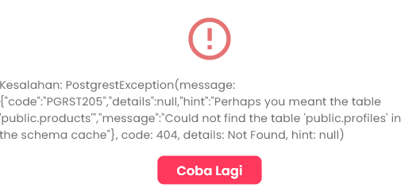

# Fix: Error "Could not find the table 'public.profiles'"

## Masalah
Error terjadi pada halaman **Permintaan Booking** dengan pesan:
```
PostgrestException(message: Could not find the table 'public.profiles' in the schema cache)
```

## Penyebab
Database menggunakan tabel `users`, tetapi kode Dart dan SQL views masih mereferensi tabel `profiles` yang tidak ada.

## Solusi yang Diterapkan

### 1. SQL Files - Diperbaiki ✅
- ✅ [supabase_fix_bookings_view_payment_status.sql](supabase_fix_bookings_view_payment_status.sql)
- ✅ [supabase_booking_delivery_system.sql](supabase_booking_delivery_system.sql)
- ✅ **BARU:** [supabase_fix_profiles_to_users.sql](supabase_fix_profiles_to_users.sql)

### 2. Dart Repository Files - Diperbaiki ✅
Mengganti semua referensi `from('profiles')` menjadi `from('users')`:

- ✅ [profile_repository.dart](lib/features/auth/data/repositories/profile_repository.dart) - 3 lokasi
- ✅ [report_repository.dart](lib/features/admin/data/repositories/report_repository.dart) - 1 lokasi  
- ✅ [admin_repository.dart](lib/features/admin/data/admin_repository.dart) - 4 lokasi

### 3. Bonus Fix: Await Missing ✅
Juga memperbaiki masalah `Instance of 'Future<String?>'` di:
- ✅ [booking_repository.dart](lib/features/booking/data/repositories/booking_repository.dart) - 5 lokasi
- ✅ profile_repository.dart - 3 lokasi
- ✅ report_repository.dart - 1 lokasi

## Cara Menjalankan Fix

### Langkah 1: Jalankan SQL Migration di Supabase
Buka **Supabase Dashboard** → **SQL Editor** → jalankan:

```sql
-- File: supabase_fix_profiles_to_users.sql
```

Atau copy-paste isi file tersebut ke SQL Editor.

### Langkah 2: Test
1. Restart aplikasi Flutter
2. Login sebagai owner yang memiliki produk
3. Buka menu **Permintaan Booking**
4. Error seharusnya sudah hilang ✅

## Ringkasan Perubahan

| File Type | Lokasi | Perubahan |
|-----------|--------|-----------|
| SQL View | `bookings_with_details` | `JOIN profiles` → `JOIN users` |
| Dart Repo | 3 repository files | `.from('profiles')` → `.from('users')` |
| Dart Repo | 3 repository files | `SupabaseConfig.currentUserId` → `await SupabaseConfig.currentUserId` |

## Catatan
Pastikan tabel `users` sudah ada di database. Jika belum, jalankan terlebih dahulu:
- [supabase_FINAL_clean_auth.sql](supabase_FINAL_clean_auth.sql)
