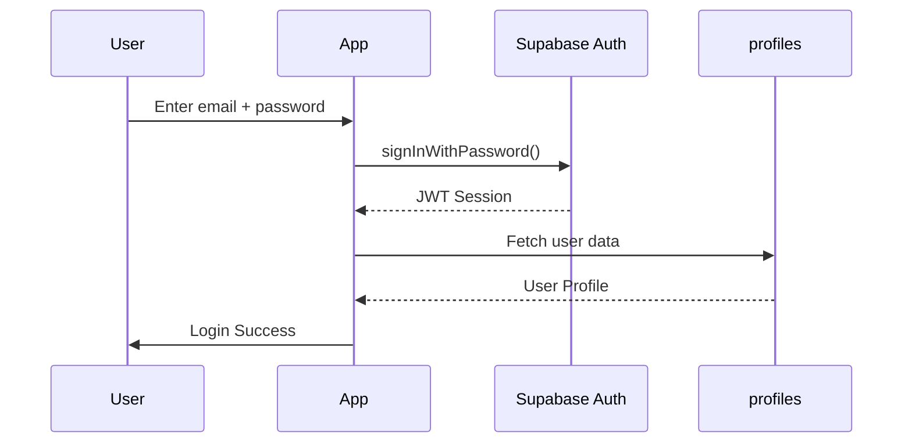
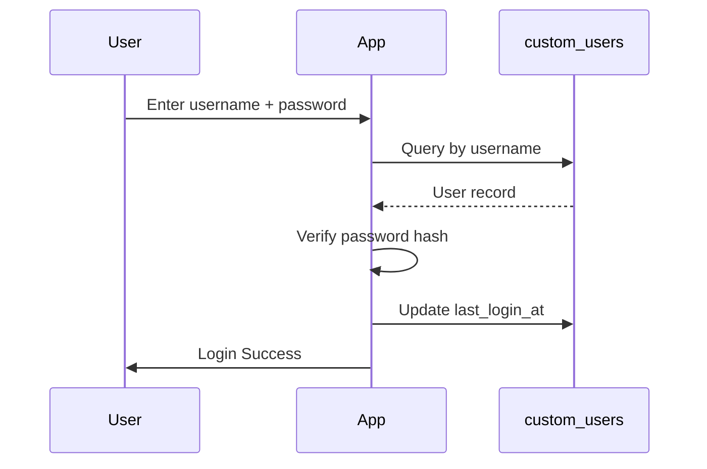

# Hybrid Authentication System - Implementation Guide

## Overview

This guide explains how to implement a hybrid authentication system that supports **both** Supabase Auth (existing users) and Custom User Management (new users) without breaking existing functionality.

---

## 📋 Table of Contents

1. [Architecture Overview](#architecture-overview)
2. [Database Schema Changes](#database-schema-changes)
3. [Authentication Flow](#authentication-flow)
4. [Implementation Steps](#implementation-steps)
5. [Flutter Integration](#flutter-integration)
6. [Security Considerations](#security-considerations)
7. [Testing Guide](#testing-guide)
8. [Migration Checklist](#migration-checklist)

---

## 🏗️ Architecture Overview

### Current State (Before Migration)
```
┌─────────────────┐
│  Supabase Auth  │ ← All users
│   (auth.users)  │
└────────┬────────┘
         │
         ├──────→ profiles table (Foreign Key)
         │
         └──────→ All app features
```

### New State (After Migration)
```
┌─────────────────┐         ┌──────────────────┐
│  Supabase Auth  │         │  Custom Users    │
│   (auth.users)  │         │ (custom_users)   │
└────────┬────────┘         └────────┬─────────┘
         │                           │
         ├──→ profiles (auth_type:   │
         │       supabase_auth)      │
         │                           │
         └───────────┬───────────────┘
                     │
                     ↓
            ┌────────────────┐
            │  all_users view│ ← Unified query layer
            └────────────────┘
                     │
                     └──────→ All app features
```

---

## 💾 Database Schema Changes

### 1. Custom Users Table

New table for manual user management:

```sql
CREATE TABLE custom_users (
  id UUID PRIMARY KEY,
  username TEXT UNIQUE NOT NULL,
  password_hash TEXT NOT NULL,
  email TEXT,                    -- Optional
  full_name TEXT,
  phone_number TEXT,
  avatar_url TEXT,
  role TEXT DEFAULT 'user',
  is_banned BOOLEAN DEFAULT false,
  -- Location fields
  latitude DOUBLE PRECISION,
  longitude DOUBLE PRECISION,
  address TEXT,
  city TEXT,
  location_updated_at TIMESTAMPTZ,
  -- Security fields
  last_login_at TIMESTAMPTZ,
  login_attempts INTEGER DEFAULT 0,
  locked_until TIMESTAMPTZ,
  -- Timestamps
  created_at TIMESTAMPTZ DEFAULT NOW(),
  updated_at TIMESTAMPTZ DEFAULT NOW()
);
```

**Key Fields:**
- `username`: Unique identifier (3+ chars, alphanumeric + underscore)
- `password_hash`: Bcrypt/Argon2 hash (NEVER plain text)
- `email`: Optional (no validation required)
- `login_attempts`: Rate limiting for security
- `locked_until`: Account lockout after 5 failed attempts

### 2. Profiles Table Update

Add auth type column to existing profiles:

```sql
ALTER TABLE profiles 
ADD COLUMN auth_type TEXT DEFAULT 'supabase_auth' 
CHECK (auth_type IN ('supabase_auth', 'custom'));
```

### 3. Unified View

Query all users regardless of auth type:

```sql
CREATE VIEW all_users AS
  SELECT id, email, full_name, ..., 'supabase_auth' AS auth_type 
  FROM profiles
UNION ALL
  SELECT id, email, full_name, ..., 'custom' AS auth_type 
  FROM custom_users;
```

---

## 🔄 Authentication Flow

### Supabase Auth Flow (Existing Users)



**No changes required** - existing flow remains intact.

### Custom Auth Flow (New Users)



**Manual session management** required in Flutter.

---

## 🛠️ Implementation Steps

### Step 1: Run Database Migration

Execute the SQL migration script:

```bash
# In Supabase SQL Editor, run:
supabase_hybrid_auth_migration.sql
```

**Verification:**
```sql
-- Check if migration succeeded
SELECT COUNT(*) FROM custom_users;
SELECT COUNT(*) FROM profiles WHERE auth_type = 'supabase_auth';
SELECT * FROM all_users LIMIT 5;
```

### Step 2: Add Crypto Package

Update `pubspec.yaml`:

```yaml
dependencies:
  crypto: ^3.0.3  # For password hashing (temporary)
```

Run:
```bash
flutter pub get
```

### Step 3: Update Authentication Repository

**Option A: Replace existing repository**

Rename `auth_repository.dart` to `auth_repository_legacy.dart`, then use `hybrid_auth_repository.dart` as the new repository.

**Option B: Extend existing repository (recommended)**

Keep both repositories and route based on user choice:

```dart
class AuthService {
  final AuthRepository _legacyRepo = AuthRepository();
  final HybridAuthRepository _hybridRepo = HybridAuthRepository();

  Future<void> signIn({
    required AuthMode mode,
    String? email,
    String? username,
    required String password,
  }) async {
    if (mode == AuthMode.supabaseAuth) {
      return await _legacyRepo.signInWithEmail(
        email: email!,
        password: password,
      );
    } else {
      return await _hybridRepo.signInWithCustomAuth(
        username: username!,
        password: password,
      );
    }
  }
}
```

### Step 4: Update UI for Auth Selection

Create a login screen that lets users choose:

```dart
class LoginScreen extends StatefulWidget {
  @override
  Widget build(BuildContext context) {
    return Column(
      children: [
        // Toggle between Email and Username login
        SegmentedButton(
          segments: [
            ButtonSegment(value: AuthMode.email, label: Text('Email')),
            ButtonSegment(value: AuthMode.username, label: Text('Username')),
          ],
          selected: {_authMode},
          onSelectionChanged: (Set<AuthMode> newSelection) {
            setState(() => _authMode = newSelection.first);
          },
        ),
        
        // Dynamic input field
        if (_authMode == AuthMode.email)
          TextField(controller: _emailController, decoration: InputDecoration(labelText: 'Email'))
        else
          TextField(controller: _usernameController, decoration: InputDecoration(labelText: 'Username')),
        
        TextField(controller: _passwordController, decoration: InputDecoration(labelText: 'Password')),
        
        ElevatedButton(
          onPressed: _login,
          child: Text('Login'),
        ),
      ],
    );
  }
}
```

### Step 5: Implement Session Management

For custom auth users, implement session tokens:

**Option 1: Store in SharedPreferences (simple)**
```dart
import 'package:shared_preferences/shared_preferences.dart';

class CustomAuthSession {
  static Future<void> saveSession({
    required String userId,
    required String authType,
  }) async {
    final prefs = await SharedPreferences.getInstance();
    await prefs.setString('userId', userId);
    await prefs.setString('authType', authType);
    await prefs.setString('sessionToken', _generateToken());
  }

  static Future<bool> isAuthenticated() async {
    final prefs = await SharedPreferences.getInstance();
    final token = prefs.getString('sessionToken');
    final authType = prefs.getString('authType');
    
    if (authType == 'custom' && token != null) {
      // Validate token expiry, etc.
      return true;
    }
    return false;
  }
}
```

**Option 2: Use Supabase sessions for custom users**
```dart
// After custom auth login, create a Supabase session with custom claims
// This allows using existing Supabase session management
// Requires Edge Function or server-side logic
```

### Step 6: Update Profile Fetching

Update all profile queries to support both auth types:

```dart
Future<UnifiedUserProfile?> getCurrentUserProfile() async {
  // Check if Supabase Auth session exists
  final supabaseUser = _supabase.auth.currentUser;
  
  if (supabaseUser != null) {
    // Fetch from profiles table
    final profile = await _supabase
        .from('profiles')
        .select()
        .eq('id', supabaseUser.id)
        .single();
    return UnifiedUserProfile.fromSupabaseAuth(profile);
  } else {
    // Check custom auth session
    final customUserId = await _getCustomAuthUserId();
    if (customUserId != null) {
      final profile = await _supabase
          .from('custom_users')
          .select()
          .eq('id', customUserId)
          .single();
      return UnifiedUserProfile.fromCustomAuth(profile);
    }
  }
  
  return null;
}
```

---

## 📱 Flutter Integration

### Controller Pattern

Update your auth controller to handle both auth types:

```dart
class HybridAuthController extends StateNotifier<AsyncValue<void>> {
  final HybridAuthRepository _repository;
  
  Future<void> signInWithEmail(String email, String password) async {
    state = const AsyncValue.loading();
    try {
      final response = await _repository.signInWithSupabaseAuth(
        email: email,
        password: password,
      );
      // Handle Supabase Auth session
      state = const AsyncValue.data(null);
    } catch (e) {
      state = AsyncValue.error(e, StackTrace.current);
    }
  }
  
  Future<void> signInWithUsername(String username, String password) async {
    state = const AsyncValue.loading();
    try {
      final user = await _repository.signInWithCustomAuth(
        username: username,
        password: password,
      );
      // Store custom auth session
      await CustomAuthSession.saveSession(
        userId: user['id'],
        authType: 'custom',
      );
      state = const AsyncValue.data(null);
    } catch (e) {
      state = AsyncValue.error(e, StackTrace.current);
    }
  }
}
```

### Route Guards

Update navigation guards to check both auth types:

```dart
class AuthGuard {
  static Future<bool> isAuthenticated() async {
    // Check Supabase Auth
    if (SupabaseConfig.client.auth.currentUser != null) {
      return true;
    }
    
    // Check custom auth session
    return await CustomAuthSession.isAuthenticated();
  }
}
```

---

## 🔒 Security Considerations

### Password Hashing

⚠️ **CRITICAL**: The example uses SHA-256 for demonstration only.

**For production, you MUST use:**

1. **Bcrypt** (recommended):
   ```dart
   // Use bcrypt package
   import 'package:bcrypt/bcrypt.dart';
   
   String hashPassword(String password) {
     return BCrypt.hashpw(password, BCrypt.gensalt(logRounds: 12));
   }
   
   bool verifyPassword(String password, String hash) {
     return BCrypt.checkpw(password, hash);
   }
   ```

2. **Argon2** (most secure):
   ```dart
   // Use argon2 package
   import 'package:argon2/argon2.dart';
   
   Future<String> hashPassword(String password) async {
     final argon2 = Argon2BytesGenerator();
     // Configure and hash
   }
   ```

3. **Server-side hashing** (best practice):
   - Create Supabase Edge Function
   - Hash passwords server-side
   - Never send plain text passwords

### Rate Limiting

The migration includes built-in rate limiting:
- 5 failed login attempts → 15-minute lockout
- Tracks attempts in `login_attempts` column
- Auto-resets on successful login

### Session Security

For custom auth:
1. Generate secure tokens (UUID v4)
2. Set expiration times (30 days max)
3. Implement token refresh logic
4. Clear tokens on logout
5. Use HTTPS only

### SQL Injection Protection

Supabase client handles this automatically, but always:
- Use parameterized queries
- Never concatenate user input into SQL
- Validate all inputs

---

## 🧪 Testing Guide

### Test Cases

#### 1. Existing Supabase Auth Users
```dart
test('Existing users can login with email', () async {
  final response = await authRepo.signInWithSupabaseAuth(
    email: 'existing@user.com',
    password: 'password123',
  );
  expect(response.user, isNotNull);
  expect(response.session, isNotNull);
});
```

#### 2. New Custom Auth Users
```dart
test('New users can register with username', () async {
  final user = await authRepo.signUpWithCustomAuth(
    username: 'newuser123',
    password: 'securepass',
    fullName: 'New User',
  );
  expect(user['id'], isNotNull);
  expect(user['username'], 'newuser123');
});

test('Username uniqueness is enforced', () async {
  await authRepo.signUpWithCustomAuth(username: 'duplicate', password: 'pass');
  
  expect(
    () => authRepo.signUpWithCustomAuth(username: 'duplicate', password: 'pass'),
    throwsException,
  );
});
```

#### 3. Hybrid Scenarios
```dart
test('Both auth types work simultaneously', () async {
  // Login with Supabase Auth
  await authRepo.signInWithSupabaseAuth(email: 'email@test.com', password: 'pass1');
  
  // Login with Custom Auth (different user)
  await authRepo.signInWithCustomAuth(username: 'testuser', password: 'pass2');
  
  // Both should coexist
});
```

#### 4. Security Tests
```dart
test('Account locks after 5 failed attempts', () async {
  for (int i = 0; i < 5; i++) {
    try {
      await authRepo.signInWithCustomAuth(username: 'test', password: 'wrong');
    } catch (_) {}
  }
  
  // 6th attempt should fail with locked message
  expect(
    () => authRepo.signInWithCustomAuth(username: 'test', password: 'wrong'),
    throwsA(contains('Account is locked')),
  );
});
```

### Manual Testing Checklist

- [ ] Existing users can login with email/password
- [ ] New users can register with username/password
- [ ] Username validation works (3+ chars, alphanumeric)
- [ ] Duplicate usernames are rejected
- [ ] Email is optional for custom users
- [ ] Ban status works for both auth types
- [ ] Location features work for both auth types
- [ ] Profile updates work for both auth types
- [ ] Logout works for both auth types
- [ ] Password reset works (Supabase Auth only)

---

## ✅ Migration Checklist

### Pre-Migration
- [ ] Backup database
- [ ] Document current user count
- [ ] Test migration on staging environment
- [ ] Review RLS policies

### Migration
- [ ] Run `supabase_hybrid_auth_migration.sql`
- [ ] Verify all existing users have `auth_type = 'supabase_auth'`
- [ ] Test `all_users` view returns correct data
- [ ] Verify helper functions work

### Post-Migration
- [ ] Update Flutter dependencies (`crypto` package)
- [ ] Integrate `HybridAuthRepository`
- [ ] Update UI for auth mode selection
- [ ] Implement session management for custom users
- [ ] Update profile fetching logic
- [ ] Test all authentication flows
- [ ] Update admin dashboard to show both user types
- [ ] Monitor error logs for issues

### Rollback Plan
If issues occur:
1. Revert Flutter code changes
2. Drop custom_users table: `DROP TABLE custom_users CASCADE;`
3. Remove auth_type column: `ALTER TABLE profiles DROP COLUMN auth_type;`
4. Restore from backup if needed

---

## 📚 Additional Resources

### Files Created
1. `supabase_hybrid_auth_migration.sql` - Database migration
2. `hybrid_auth_repository.dart` - Repository implementation
3. `unified_user_profile.dart` - Unified user model

### Recommended Packages
```yaml
dependencies:
  supabase_flutter: ^2.0.0
  bcrypt: ^1.1.3           # Password hashing
  shared_preferences: ^2.2.2  # Session storage
  crypto: ^3.0.3           # Fallback hashing
```

### Future Enhancements
1. Implement password reset for custom users
2. Add 2FA support
3. Implement OAuth for custom users
4. Add email verification for custom users (optional)
5. Implement refresh tokens
6. Add biometric authentication

---

## 🆘 Troubleshooting

### Common Issues

**Issue**: RLS policies blocking custom user creation
**Solution**: Ensure the "Allow registration" policy is enabled:
```sql
CREATE POLICY "Allow registration for custom users"
  ON custom_users FOR INSERT
  WITH CHECK (true);
```

**Issue**: Can't query custom_users from Flutter
**Solution**: Check RLS policies and ensure SELECT policy allows access

**Issue**: Password verification fails
**Solution**: Ensure password hashing algorithm matches between signup and login

**Issue**: Session not persisting for custom users
**Solution**: Implement proper session storage using SharedPreferences or secure storage

---

## 📞 Support

For questions or issues:
1. Check SQL migration verification queries
2. Review Flutter error logs
3. Test each auth flow independently
4. Verify database state with `all_users` view
5. Check RLS policies are correct

---

**End of Implementation Guide**
